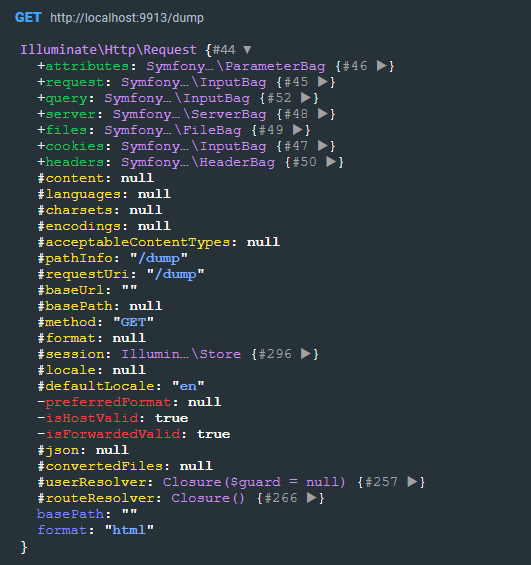
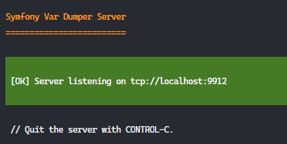
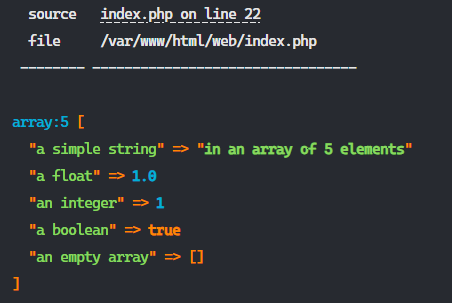

[](https://github.com/ddev/ddev-addon-template/actions/workflows/tests.yml) 

# ddev-php-dumper <!-- omit in toc -->

- [What is ddev-php-dumper?](#what-is-ddev-php-dumper)
- [What does this add-on do?](#what-does-this-add-on-do)
- [Requirements](#requirements)
- [Installation](#installation)
  - [Docker "PHP Dump" setup](#docker-php-dump-setup)
    - [Troubleshooting](#troubleshooting)
  - ["var-dump server" setup](#var-dump-server-setup)
- [Usage](#usage)
  - [Disable the service](#disable-the-service)
- [Reference](#reference)

## What is ddev-php-dumper?

"ddev-php-dumper" is a helper addon that redirects Symfony dump output to a server. Dumped data will no longer display inline on your site, but instead, be displayed in the terminal (var-dumper-server) or [PHP Dumper](https://github.com/artifision/php-dumper-docker-extension), a Desktop Docker extension.

Using PHP Dumper offers several benefits:

- auto-expand dumps to a specific level
- filter dumps by time frame
- pin dumps
- compare 2 dump



## What does this add-on do?

1. Sets environment variables to redirect "var_dump" output to PHP Dumper Docker extention.
2. Includes helper function to start a PHP dump server.
3. Adds Docker host as an extra host in the web container.

## Requirements

- [DDEV](https://ddev.com)
- [symfony/var-dumper](https://symfony.com/doc/current/components/var_dumper.html)
Requirements:

If you project is based on Symfony (such as Laravel, Drupal), it may already include 'var-dumper'.

## Installation

1. Install var-dumper, if you project does not already include it.

    ```shell
    composer require --dev symfony/var-dumper
    ```

1. Install ddev-php-dump addon and restart to activate the addon.

    ```shell
    ddev add-on get tyler36/ddev-php-dumper
    ```

    Then restart your project

    ```shell
    ddev restart
    ```

Next, you need to decide what dump server to use.

### Docker "PHP Dump" setup

Requirements:

- [Docker Desktop](https://www.docker.com/products/docker-desktop/)
- [PHP Dumper extension](https://github.com/artifision/php-dumper-docker-extension)

1. Install the PHP Dumper extension via [Docker Desktop GUI](https://docs.docker.com/desktop/extensions/marketplace/#install-an-extension) or using the following command.

    ```shell
    docker extension install artifision/php-dumper-docker-extension:latest
    ```

2. Create or update `./.ddev/.env` with:

    ```env
    VAR_DUMPER_SERVER="host.docker.internal"
    ```

3. Restart DDEV

    ```shell
    ddev restart
    ```

4. Open PHP-dumper panel in Docker Desktop.

Example output:


#### Troubleshooting

Visit the test page, http://localhost:9913/dump to check if the extension can correctly receive data.

### "var-dump server" setup

1. Open a terminal window and to start the dump server.

    ```shell
    ddev dumper
    ```

2. The server should start and be listening on `tcp://localhost:9912`



Using a `dump()` command in your project will display the output.

Example output:



## Usage

- Use `dump()` the command in your project.

The output will be redirect and displayed in your configured server.

### Disable the service

To disable the service:

```shell
ddev service disable php-dumper
ddev restart
```

To re-enable the service:

```shell
ddev service enable php-dumper
ddev restart
```

## Reference

For more information, see [The Dump Server](https://symfony.com/doc/current/components/var_dumper.html).

**Contributed and maintained by [@tyler36](https://github.com/tyler36)**
